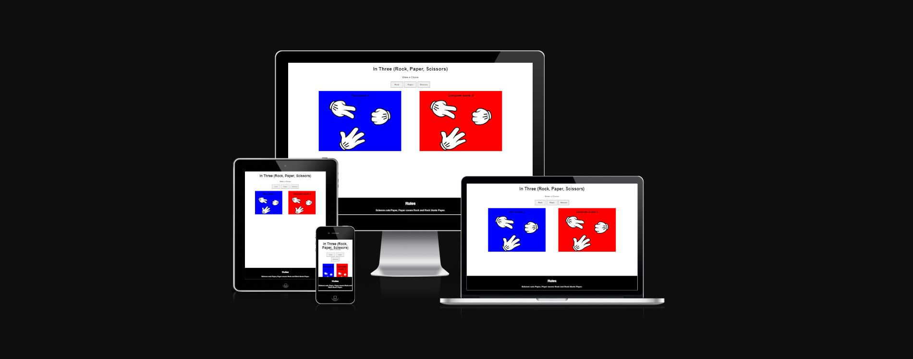

# In Three (Rock, Paper, Scissors)

In Three is a fun Rock Paper Scissors game where you play agaist a computer. You as a player get to make a choice between three options, when you have made your choice the computer player makes a random choice where the outcome is fair. It has been shown that people familiar with each other are statistically more likely to drawn when playing Rock Paper Scissors. With our game the outcome is more randomized and fair.

Users will learn the rules of Rock Paper Scissors if they never playid it before and gain knowledge that they can apply in real life. This site will be targeted towords adults and children. Age will be no facture so anyone can simply learn, practice and have fun with.

##Features

###Existing features

*Header